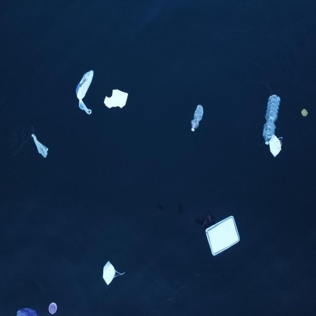

# Marine Litter Classifier 🌊

A machine learning-powered web application designed to detect and classify marine litter from images. This project provides an intuitive user interface built with Streamlit and uses a YOLO-based computer vision model to identify and count various types of marine debris.

## Overview



## Features

- **Image Upload**: Users can seamlessly upload images (JPG, JPEG, PNG) for analysis.
- **AI Detection**: Leverages a pre-trained YOLO object detection model (`yolov8.pt`) to identify and locate litter in the uploaded image.
- **Summary Report**: Automatically groups detected litter by class and displays a clean detection summary table (including total count).
- **Interactive UI**: Built with Streamlit for a fast and responsive user experience. 

## Prerequisites

Ensure you have Python installed on your system. The required libraries are defined in the `requirements.txt` file.

## Installation

1. **Navigate to the Project Directory:**
   ```bash
   cd Litter_Detection
   ```

2. **Create a Virtual Environment (Recommended):**
   ```bash
   python -m venv myenv
   source myenv/bin/activate  # On macOS/Linux
   # On Windows use: myenv\Scripts\activate
   ```

3. **Install Dependencies:**
   Install the required Python packages:
   ```bash
   pip install -r requirements.txt
   ```
   *Note: This will install `streamlit`, `ultralytics` (for YOLO), `pillow`, and other necessary dependencies like `pandas`.*

4. **Model File:**
   Ensure that your pre-trained YOLO model file, specifically named `yolov8.pt`, is placed in the root directory (alongside `app.py`).

## Usage

1. **Start the Application:**
   Run the following command in your terminal:
   ```bash
   streamlit run app.py
   ```

2. **Access the Web Interface:**
   Once the server starts, open your web browser and navigate to `http://localhost:8501` (or the URL provided in the terminal).

3. **Classify Litter:**
   - Click **"Browse files"** and select a marine image from your local machine.
   - The application will process the image, draw bounding boxes around detected litter, and render a detection summary.
